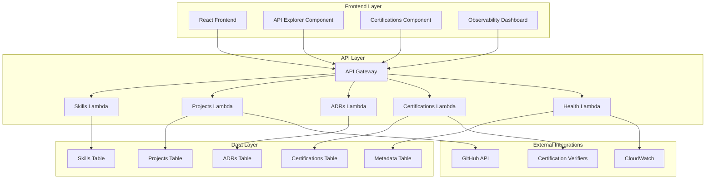

# Design Document

## Overview

This design enhances the existing Living Architecture Resume (LAR) system by adding certifications management, improving API interactivity, integrating real data sources, and enhancing observability. The design maintains the core philosophy of "proof by existing" while expanding functionality to create a more comprehensive and interactive professional showcase.

## Architecture

The enhanced system builds upon the existing serverless architecture:



## Components and Interfaces

### Certifications Manager

**Purpose**: Manages professional certifications with verification capabilities

**Interface**:
```typescript
interface Certification {
  id: string;
  name: string;
  issuer: 'AWS' | 'Azure' | 'GCP' | 'Other';
  category: 'cloud' | 'security' | 'devops' | 'data';
  dateObtained: string;
  expiryDate?: string;
  credentialId: string;
  verificationUrl: string;
  badgeUrl?: string;
  isExpired: boolean;
  renewalRequired: boolean;
}

interface CertificationAPI {
  getAll(filters?: { issuer?: string; category?: string; includeExpired?: boolean }): Promise<Certification[]>;
  getById(id: string): Promise<Certification>;
  verify(id: string): Promise<VerificationStatus>;
}
```

**DynamoDB Schema**:
- Primary Key: `id` (string)
- GSI: `issuer-dateObtained-index` for filtering by provider
- GSI: `category-dateObtained-index` for filtering by category

### Enhanced API Explorer

**Purpose**: Interactive API testing interface with real-time execution

**Interface**:
```typescript
interface APIEndpoint {
  method: 'GET' | 'POST' | 'PUT' | 'DELETE';
  path: string;
  description: string;
  parameters: Parameter[];
  responses: ResponseExample[];
}

interface Parameter {
  name: string;
  type: 'string' | 'number' | 'boolean';
  required: boolean;
  description: string;
  example: any;
}

interface APIExplorerState {
  selectedEndpoint: APIEndpoint;
  parameters: Record<string, any>;
  response: APIResponse | null;
  loading: boolean;
  error: string | null;
}
```

### Real Data Integrator

**Purpose**: Manages integration with live data sources and external APIs

**Interface**:
```typescript
interface DataSource {
  type: 'dynamodb' | 'github' | 'cloudwatch';
  config: Record<string, any>;
}

interface DataIntegrator {
  fetchSkills(filters?: SkillFilters): Promise<Skill[]>;
  fetchProjects(includeGitHubData?: boolean): Promise<Project[]>;
  fetchSystemMetrics(): Promise<SystemMetrics>;
  validateDataIntegrity(): Promise<ValidationResult>;
}
```

### Evidence Linker

**Purpose**: Manages and validates evidence links for skills and projects

**Interface**:
```typescript
interface EvidenceLink {
  type: 'repository' | 'demo' | 'pipeline' | 'dashboard' | 'documentation';
  url: string;
  status: 'active' | 'inactive' | 'unknown';
  lastChecked: string;
  metadata?: Record<string, any>;
}

interface EvidenceLinker {
  validateLinks(links: EvidenceLink[]): Promise<LinkValidationResult[]>;
  enrichProjectData(project: Project): Promise<EnrichedProject>;
  getGitHubStats(repoUrl: string): Promise<GitHubStats>;
}
```

### Observability Dashboard

**Purpose**: Real-time system health and metrics display

**Interface**:
```typescript
interface SystemMetrics {
  apiLatency: {
    average: number;
    p95: number;
    p99: number;
  };
  errorRate: number;
  uptime: number;
  requestCount: number;
  lastDeployment: {
    version: string;
    timestamp: string;
    status: 'success' | 'failed';
  };
}

interface ObservabilityDashboard {
  getMetrics(timeRange?: string): Promise<SystemMetrics>;
  getErrorLogs(limit?: number): Promise<ErrorLog[]>;
  getDeploymentHistory(): Promise<Deployment[]>;
}
```

## Data Models

### Certifications Table
```json
{
  "id": "aws-saa-c03-2024",
  "name": "AWS Solutions Architect Associate",
  "issuer": "AWS",
  "category": "cloud",
  "dateObtained": "2024-03-15",
  "expiryDate": "2027-03-15",
  "credentialId": "ABC123XYZ",
  "verificationUrl": "https://aws.amazon.com/verification/ABC123XYZ",
  "badgeUrl": "https://images.credly.com/size/340x340/images/badge.png",
  "isExpired": false,
  "renewalRequired": false,
  "skills": ["AWS", "Architecture", "Security"],
  "createdAt": "2024-03-15T10:00:00Z",
  "updatedAt": "2024-03-15T10:00:00Z"
}
```

### Enhanced Skills Table
```json
{
  "id": "aws-lambda",
  "name": "AWS Lambda",
  "category": "cloud",
  "cloud": "aws",
  "proficiency": "advanced",
  "yearsExperience": 3,
  "usageCount": 12,
  "technologies": ["Python", "Node.js", "TypeScript"],
  "evidenceLinks": [
    {
      "type": "repository",
      "url": "https://github.com/oyintech/lambda-examples",
      "status": "active",
      "lastChecked": "2024-12-30T10:00:00Z"
    }
  ],
  "certifications": ["aws-saa-c03-2024"],
  "projects": ["oyins-journey", "event-processor"],
  "createdAt": "2024-01-01T00:00:00Z",
  "updatedAt": "2024-12-30T10:00:00Z"
}
```

### System Metadata Table
```json
{
  "id": "system-version",
  "version": "v2.1.0",
  "deployedAt": "2024-12-30T10:00:00Z",
  "features": ["certifications", "enhanced-api-explorer", "real-data-integration"],
  "metrics": {
    "totalSkills": 15,
    "totalProjects": 8,
    "totalCertifications": 4,
    "totalADRs": 6
  }
}
```

## Correctness Properties

*A property is a characteristic or behavior that should hold true across all valid executions of a system-essentially, a formal statement about what the system should do. Properties serve as the bridge between human-readable specifications and machine-verifiable correctness guarantees.*

### Property Reflection

After analyzing all acceptance criteria, several properties can be consolidated to eliminate redundancy:

- Properties 1.1 and 1.2 both test certification data completeness and can be combined into a comprehensive certification data integrity property
- Properties 4.1, 4.4, and 4.5 all relate to evidence link management and can be consolidated into a comprehensive evidence link validation property
- Properties 2.1, 2.2, 2.3, and 2.4 all test API Explorer functionality and can be combined into comprehensive API Explorer behavior properties

### Core Properties

**Property 1: Certification Data Integrity**
*For any* certification dataset, all returned certifications should contain complete metadata (name, issuer, dates, verification link) and correct expiration status based on current date
**Validates: Requirements 1.1, 1.2, 1.3**

**Property 2: Certification Filtering Accuracy**
*For any* provider filter (AWS, Azure, GCP), the returned certifications should only include items matching that specific provider
**Validates: Requirements 1.4**

**Property 3: API Explorer Endpoint Documentation**
*For any* selected API endpoint, the explorer should display complete documentation including parameters and response examples
**Validates: Requirements 2.1**

**Property 4: API Explorer Request-Response Cycle**
*For any* API call execution, the explorer should display both the request details and the actual response data
**Validates: Requirements 2.2**

**Property 5: API Explorer URL Generation**
*For any* parameter modification, the displayed request URL should accurately reflect all current parameter values
**Validates: Requirements 2.3**

**Property 6: API Explorer Error Handling**
*For any* failed API call, the explorer should display clear error messages and appropriate HTTP status codes
**Validates: Requirements 2.4**

**Property 7: Project Data Enrichment**
*For any* project with GitHub links, the displayed data should include repository information and commit activity
**Validates: Requirements 3.2**

**Property 8: Data Loading Error Handling**
*For any* data loading failure, the system should gracefully handle the error and provide appropriate fallback mechanisms
**Validates: Requirements 3.5**

**Property 9: Evidence Link Validation**
*For any* evidence link, the system should validate accessibility and display appropriate status and messaging for unavailable resources
**Validates: Requirements 4.1, 4.2, 4.5**

**Property 10: Project Evidence Enrichment**
*For any* project display, the system should include GitHub commit activity and pipeline status information
**Validates: Requirements 4.3**

**Property 11: Skills Evidence Linking**
*For any* skill entry, the system should provide links to specific code examples or implementation evidence
**Validates: Requirements 4.4**

**Property 12: Metrics Update Timeliness**
*For any* metrics display, the observability dashboard should update data within acceptable time windows (near real-time)
**Validates: Requirements 5.5**

**Property 13: Data Persistence Consistency**
*For any* new skill or certification addition, the change should be immediately reflected in subsequent queries
**Validates: Requirements 6.2**

**Property 14: Data Integrity Preservation**
*For any* data modification, the system should maintain referential integrity and relationships between related entities
**Validates: Requirements 6.3**

<function_calls>
<invoke name="prework">
<parameter name="featureName">living-architecture-resume-enhancement

## Error Handling

### API Error Responses
- **404 Not Found**: When requesting non-existent resources (skills, projects, certifications)
- **400 Bad Request**: When providing invalid query parameters or filters
- **500 Internal Server Error**: When DynamoDB or external service integration fails
- **503 Service Unavailable**: When external services (GitHub, CloudWatch) are temporarily unavailable

### Data Loading Fallbacks
- **Mock Data Fallback**: When DynamoDB is unavailable, serve cached or mock data with clear indicators
- **Partial Data Display**: When some external integrations fail, display available data with status indicators
- **Graceful Degradation**: When GitHub API is unavailable, show projects without commit data but indicate the limitation

### Evidence Link Validation
- **Link Status Tracking**: Regularly validate evidence links and update status (active/inactive/unknown)
- **Broken Link Handling**: Display clear messaging for unavailable evidence with last-checked timestamps
- **Timeout Handling**: Set reasonable timeouts for external link validation to prevent blocking

### Frontend Error Boundaries
- **Component-Level Error Handling**: Isolate failures to prevent entire page crashes
- **User-Friendly Messages**: Convert technical errors into actionable user messages
- **Retry Mechanisms**: Provide retry options for transient failures

## Testing Strategy

### Dual Testing Approach
The system will use both unit testing and property-based testing for comprehensive coverage:

**Unit Tests**: Verify specific examples, edge cases, and error conditions
- Test specific certification expiry date calculations
- Test API parameter validation with known invalid inputs
- Test error handling with simulated service failures
- Test UI component rendering with specific data sets

**Property Tests**: Verify universal properties across all inputs
- Test certification data integrity across randomly generated datasets
- Test filtering logic with various provider combinations
- Test API Explorer behavior with randomly generated endpoints and parameters
- Test evidence link validation with various URL formats and statuses

### Property-Based Testing Configuration
- **Testing Library**: Jest with fast-check for TypeScript/JavaScript components
- **Test Iterations**: Minimum 100 iterations per property test
- **Test Tagging**: Each property test tagged with format: **Feature: living-architecture-resume-enhancement, Property {number}: {property_text}**

### Integration Testing
- **API Integration**: Test real API calls to DynamoDB and external services
- **End-to-End Flows**: Test complete user journeys through the enhanced interface
- **External Service Mocking**: Mock GitHub and CloudWatch APIs for consistent testing

### Performance Testing
- **API Response Times**: Ensure all endpoints respond within 200ms under normal load
- **Data Loading Performance**: Test large dataset handling and pagination
- **Frontend Rendering**: Ensure smooth UI updates during data loading and filtering

The testing strategy ensures both concrete functionality validation through unit tests and comprehensive input coverage through property-based testing, providing confidence in system correctness across all scenarios.