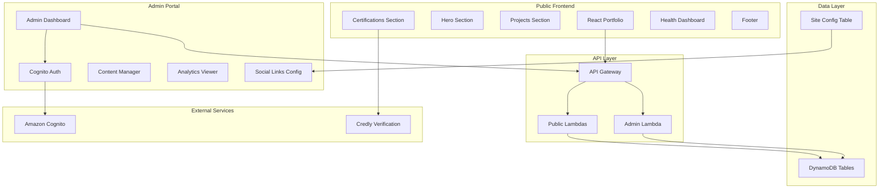

# Design Document

## Overview

This design transforms the Oyin's Journey portfolio from a generic template into a fully personalized, admin-managed professional showcase. The system adds Amazon Cognito authentication for an admin portal, visitor analytics, configurable social links, Credly certification verification, and UI/UX improvements including simplified health dashboard and conditional project links.

## Architecture



## Components and Interfaces

### Admin Portal Authentication

**Purpose**: Secure admin access using Amazon Cognito

**Interface**:
```typescript
interface AuthConfig {
  userPoolId: string;
  clientId: string;
  region: string;
}

interface AuthState {
  isAuthenticated: boolean;
  user: CognitoUser | null;
  loading: boolean;
  error: string | null;
}

interface AuthService {
  signIn(username: string, password: string): Promise<AuthResult>;
  signOut(): Promise<void>;
  getCurrentUser(): Promise<CognitoUser | null>;
  refreshSession(): Promise<void>;
}
```

### Content Management

**Purpose**: CRUD operations for portfolio content

**Interface**:
```typescript
interface ContentManager {
  // Certifications
  addCertification(cert: CertificationInput): Promise<Certification>;
  updateCertification(id: string, cert: Partial<CertificationInput>): Promise<Certification>;
  deleteCertification(id: string): Promise<void>;
  
  // Skills
  addSkill(skill: SkillInput): Promise<Skill>;
  updateSkill(id: string, skill: Partial<SkillInput>): Promise<Skill>;
  deleteSkill(id: string): Promise<void>;
  
  // Projects
  addProject(project: ProjectInput): Promise<Project>;
  updateProject(id: string, project: Partial<ProjectInput>): Promise<Project>;
  deleteProject(id: string): Promise<void>;
}

interface CertificationInput {
  name: string;
  provider: 'AWS' | 'Azure' | 'GCP' | 'Other';
  issueDate: string;
  expiryDate?: string;
  credentialId?: string;
  credlyUrl?: string;
  badgeUrl?: string;
}

interface ProjectInput {
  name: string;
  description: string;
  technologies: string[];
  status: 'active' | 'completed' | 'in-progress';
  repositoryUrl?: string;  // Optional
  demoUrl?: string;        // Optional
  startDate: string;
}
```

### Social Links Configuration

**Purpose**: Manage configurable social media links

**Interface**:
```typescript
interface SocialLinks {
  linkedin?: string;
  github?: string;
  email?: string;
  twitter?: string;
  website?: string;
}

interface SiteConfig {
  socialLinks: SocialLinks;
  branding: {
    name: string;
    tagline: string;
  };
  sourceRepoUrl: string;
  liveApiUrl: string;
}

interface SocialLinksManager {
  getSocialLinks(): Promise<SocialLinks>;
  updateSocialLinks(links: SocialLinks): Promise<void>;
  validateUrl(url: string): boolean;
}
```

### Visitor Analytics

**Purpose**: Track anonymous visitor statistics

**Interface**:
```typescript
interface VisitorAnalytics {
  pageViews: number;
  uniqueVisitors: number;
  popularSections: SectionStats[];
  timeRange: string;
}

interface SectionStats {
  section: string;
  views: number;
  percentage: number;
}

interface AnalyticsService {
  recordPageView(section: string): Promise<void>;
  getAnalytics(timeRange?: string): Promise<VisitorAnalytics>;
}
```

## Data Models

### Site Configuration Table
```json
{
  "id": "site-config",
  "socialLinks": {
    "linkedin": "https://linkedin.com/in/oyindamola-oladipo",
    "github": "https://github.com/oyindamola-oladipo",
    "email": "mailto:hello@oyins-journey.dev"
  },
  "branding": {
    "name": "Oyin",
    "tagline": "Cloud Engineer & Solutions Architect"
  },
  "sourceRepoUrl": "https://github.com/oyindamola-oladipo/oyins-journey",
  "liveApiUrl": "https://api.oyins-journey.dev",
  "updatedAt": "2024-12-30T10:00:00Z"
}
```

### Enhanced Certification Model
```json
{
  "id": "aws-saa-c03",
  "name": "AWS Solutions Architect Associate",
  "provider": "AWS",
  "issueDate": "2024-01-15",
  "expiryDate": "2027-01-15",
  "credentialId": "AWS-SAA-123456",
  "credlyUrl": "https://www.credly.com/badges/abc123",
  "badgeUrl": "https://images.credly.com/badges/abc123.png",
  "computed_status": "active"
}
```

### Enhanced Project Model
```json
{
  "id": "living-architecture-resume",
  "name": "Living Architecture Resume",
  "description": "Self-documenting cloud architecture portfolio",
  "technologies": ["TypeScript", "React", "Terraform", "AWS"],
  "status": "active",
  "repositoryUrl": "https://github.com/oyindamola-oladipo/oyins-journey",
  "demoUrl": "https://oyins-journey.dev",
  "startDate": "2024-12"
}
```

## Correctness Properties

*A property is a characteristic or behavior that should hold true across all valid executions of a system-essentially, a formal statement about what the system should do. Properties serve as the bridge between human-readable specifications and machine-verifiable correctness guarantees.*

### Property 1: Authentication Access Control
*For any* request to admin endpoints, unauthenticated requests should be rejected with 401 status, and authenticated requests with valid tokens should be allowed access.
**Validates: Requirements 1.1, 1.3**

### Property 2: Content CRUD Round-Trip
*For any* content item (certification, skill, or project), adding it via admin should make it retrievable via public API, updating it should reflect changes, and deleting it should remove it from public access.
**Validates: Requirements 2.1, 2.2, 2.4, 2.5**

### Property 3: Optional Project Fields Handling
*For any* project, the system should correctly handle optional repositoryUrl and demoUrl fields - storing them when provided and allowing null/undefined when not provided.
**Validates: Requirements 2.3**

### Property 4: Social Links Conditional Display
*For any* social links configuration, configured links should appear in header, hero, and footer sections, while unconfigured links should be hidden.
**Validates: Requirements 3.2, 3.3, 10.1, 10.4**

### Property 5: URL Validation
*For any* URL input for social links, the system should accept valid URLs (http/https with proper format) and reject invalid formats.
**Validates: Requirements 3.5**

### Property 6: Credly Integration Conditional Display
*For any* certification, the "Verify on Credly" button should appear only when credlyUrl is present, and badge images should display only when badgeUrl is present.
**Validates: Requirements 4.1, 4.3, 4.5**

### Property 7: Project Links Conditional Display
*For any* project, the "Repo" button should appear only when repositoryUrl is present, and the "Demo" button should appear only when demoUrl is present.
**Validates: Requirements 5.1, 5.2, 5.3, 5.4, 9.2, 9.4**

### Property 8: Health Dashboard Content Exclusion
*For any* health dashboard render, the output should NOT contain environment info, region info, or deployment info section, and should use "Technology" instead of "Infrastructure".
**Validates: Requirements 6.1, 6.2, 6.3, 6.4**

### Property 9: Health Dashboard Graceful Fallback
*For any* API failure scenario, the health dashboard should display graceful fallback data without showing raw "Network Error" messages.
**Validates: Requirements 6.6**

### Property 10: Analytics Privacy Compliance
*For any* analytics record, the stored data should not contain PII (no IP addresses, no user identifiers, no personal information).
**Validates: Requirements 8.4**

### Property 11: Project Status Display
*For any* project, the status (active, completed, in-progress) should be displayed correctly based on the project data.
**Validates: Requirements 9.3**

## Error Handling

### Authentication Errors
- **401 Unauthorized**: Invalid or missing authentication token
- **403 Forbidden**: Valid token but insufficient permissions
- **Token Expiry**: Automatic redirect to login with session expired message

### Content Management Errors
- **400 Bad Request**: Invalid input data (missing required fields, invalid formats)
- **404 Not Found**: Attempting to update/delete non-existent content
- **409 Conflict**: Duplicate content ID

### API Fallback Strategy
- **Network Errors**: Display cached data with "offline" indicator
- **API Unavailable**: Show graceful fallback without technical error messages
- **Partial Failures**: Display available data, hide failed sections

## Testing Strategy

### Dual Testing Approach

**Unit Tests**: Verify specific examples and edge cases
- Test authentication flow with valid/invalid credentials
- Test content CRUD operations with specific data
- Test URL validation with known valid/invalid URLs
- Test conditional rendering with specific configurations

**Property Tests**: Verify universal properties across all inputs
- Test authentication access control across random requests
- Test content round-trip with randomly generated content
- Test social links display with various configurations
- Test project links conditional display with random project data

### Property-Based Testing Configuration
- **Testing Library**: Jest with fast-check for TypeScript/React components
- **Test Iterations**: Minimum 100 iterations per property test
- **Test Tagging**: Format: **Feature: portfolio-personalization, Property {number}: {property_text}**

### Integration Testing
- Test Cognito authentication flow end-to-end
- Test admin content management with real DynamoDB
- Test public site reflects admin changes
